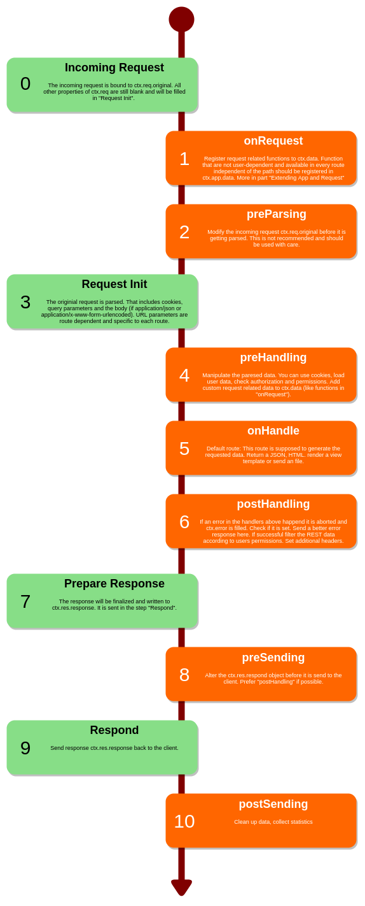

# Request Handlers and Lifecycle

The following assumes that an instance of an `Application` already exists. Since `Application` inherits the routing methods from `Router`, the further explanations work analogously for `Router`.

```ts
const app = new Application();

// The methods work similarly with router
const router = new Router();
```

## Handlers

### Handler Methods

`app` supports several methods depending on the used HTTP method. Handlers under `.use()` are called for all methods, corresponding to `.get()` only, for a request with the HTTP method `GET`. For user-defined methods or if denotrain does not support a special method, `.add()` can be used.

`.use()` is supposed to be used with router and should not be used with a router function. Futher examples on this page using `.use()` are for demo purposes only.

```ts
app.use("/", () => {});
app.get("/", () => {});
app.head("/", () => {});
app.post("/", () => {});
app.put("/", () => {});
app.delete("/", () => {});
app.patch("/", () => {});

app.add("/", "GET", () => {});
app.add("/", "OPTIONS", () => {});
app.add("/", "CUSTOM", () => {});
```

### Request Handler Types

`RequestHandler' can be either a function or a router. If it is a function, then it will only be executed if the route ends with that of the handler. If, on the other hand, it is a router, then it will be executed even if the handler's route is in the middle of the requested route.

The request handler function can also be asynchronous and return a promise. The possible return values are described in more detail in the next tutorial.

```ts
//     matching /
// not matching /home
app.use("/", () => "Hello World!");

//     matching /
// not matching /home
app.use("/", async () => "Hello World!");

const nested = new Router();
// not matching /
//     matching /sub
// not matching /home
//     matching /sub/home
app.use("/sub", nested);

// not matching /
// not matching /sub
// not matching /home
//     matching /sub/home
nested.use("/home", () => "Hello World!");
```

### Chaining Handlers

Several request handlers can be chained one after the other and combined into one statement. This is the same as writing the individual request handlers one after the other and is practical for middleware. The order is important. The following code sections are semantically identical (semantic sugar).

```ts
app.use("/sub", middleware, () => "Hello World!");
```

und

```ts
app.use("/sub", middleware);
app.use("/sub", () => "Hello World!");
```

### Specifying the Path

The specified path can be a static text, contain URL parameters or be a regex. If no path is specified or if it is `null`, then this route always applies.

The specified path can also be an object to specify further details, such as the desired lifecycle hook. More about lifecycles in the next section.

```ts
// this routes always applies
app.use(null, () => "Hello World!");
app.use(() => "Hello World!");

// this route applies on /home
app.use("/home", () => "Hello World!");

// this route applies on /home/:id
// where `:id` is substituted by
// an number, boolean (true/false) or string
// It will be automatically converted if possible
// /home/7 ---> ctx.req.params = {id: 7}
// /home/test ---> ctx.req.params = {id: "test"}
// /home/true ---> ctx.req.params = {id: true}
app.use("/home/:id", () => "Hello World!");

// this route applies on /home and /hooooome
// but not on /hme
app.use(/\/ho+me/, () => "Hello World!");

// this route applies on /demo
app.use({path: "/demo"}, () => "Hello World!");

// this route applies on /demo
// executed directly after a request was started
app.use({path: "/demo", lifecycle: "onRequest"}, someOnRequestMiddleware);
```

## Lifecycle

During the processing of a request there are different statuses. You can intervene at any point in the lifecycle. The various lifecycle handlers are listed in more detail in the diagram below - together with their recommended purpose. The standard request handler is `onHandle`. If no other handler is specified, this one is used. To specify a particular handler, it must be specified as an object together with the path.

```ts
// this route applies on /demo
// executed directly after a request was started
app.use({path: "/demo", lifecycle: "onRequest"}, someOnRequestMiddleware);
```

If an error is thrown in one of the first four lifecycle states (`onRequest`, `preParsing`, `preHandling` or `onHandle`), no further handlers from the lifecycle up to and including 'onHandle' are executed. The thrown error is referenced in `ctx.error`. In addition, in the case of a `ClientError`, the body and the status code are automatically set accordingly. If the error is not a `ClientError`, the error is logged in the output and the body and status code are set according to an "Internal server error" (500).

If an error occurs in one of the later lifecycle handlers, the error is automatically logged, but `ctx.error` and the response object are not changed. 


